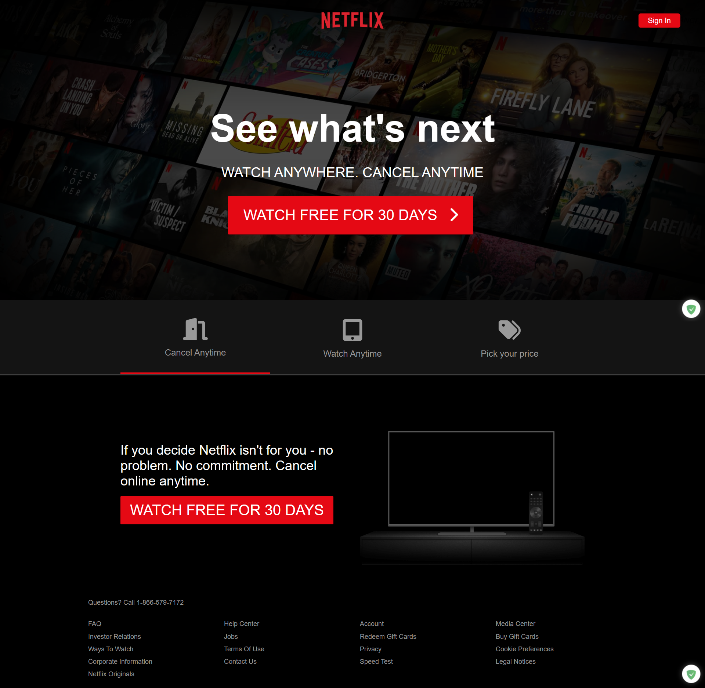

# Netflix Clone

> A static front-end replica of Netflix’s landing page.




## 🛠️ Tech Stack
* HTML5
* CSS3 (with custom styling)
* Vanilla JavaScript (ES6+)
* Font Awesome (for icons)


## 🚀 Quick Start

```bash
git clone https://github.com/Vladislav-C/Netflix-clone.git
cd Netflix-clone

# Option A: Python 3
python3 -m http.server 8000

# Option B: Node
npx http-server . -p 8000